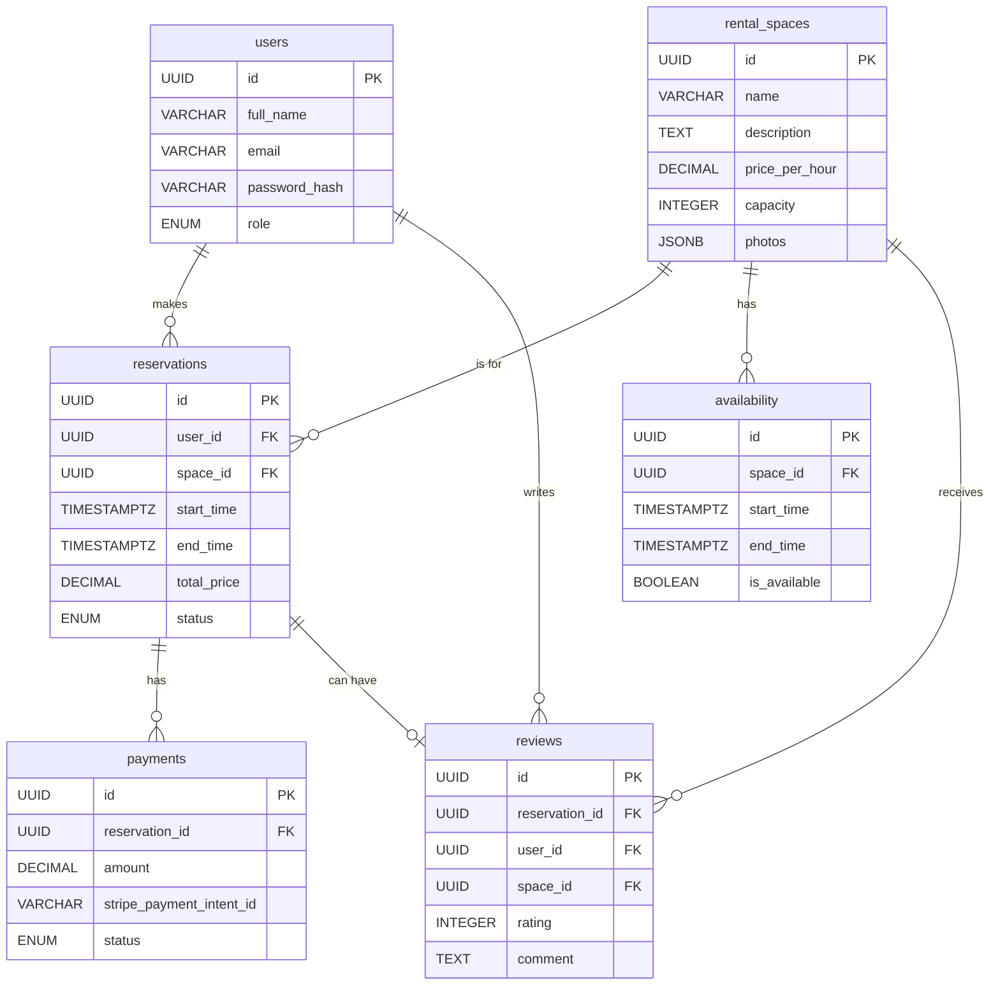

# Database Schema Design

This document outlines the database schema for the rental booking system. The schema is designed for a PostgreSQL database and includes tables for managing users, rental spaces, reservations, payments, availability, and reviews.

## Table Definitions

### 1. `users`

This table stores information about registered users, including both administrators and customers.

| Column          | Data Type | Constraints                | Description                                      |
| --------------- | --------- | -------------------------- | ------------------------------------------------ |
| `id`            | `UUID`    | `PRIMARY KEY`              | Unique identifier for the user.                  |
| `full_name`     | `VARCHAR` | `NOT NULL`                 | User's full name.                                |
| `email`         | `VARCHAR` | `UNIQUE NOT NULL`          | User's email address.                            |
| `password_hash` | `VARCHAR` | `NOT NULL`                 | Hashed password for user authentication.         |
| `role`          | `ENUM`    | `'admin', 'customer'`      | User's role (administrator or customer).         |
| `created_at`    | `TIMESTAMPTZ` | `DEFAULT NOW()`            | Timestamp of when the user was created.          |
| `updated_at`    | `TIMESTAMPTZ` | `DEFAULT NOW()`            | Timestamp of the last update to the user record. |

### 2. `rental_spaces`

This table contains details about the rental spaces available for booking.

| Column           | Data Type | Constraints     | Description                                                  |
| ---------------- | --------- | --------------- | ------------------------------------------------------------ |
| `id`               | `UUID`    | `PRIMARY KEY`   | Unique identifier for the rental space.                      |
| `name`             | `VARCHAR` | `NOT NULL`      | Name of the rental space.                                    |
| `description`      | `TEXT`    |                 | Detailed description of the rental space.                    |
| `price_per_hour` | `DECIMAL` | `NOT NULL`      | Cost to rent the space for one hour.                         |
| `capacity`         | `INTEGER` |                 | Maximum number of people the space can accommodate.          |
| `photos`           | `JSONB`   |                 | JSON array of image URLs from Cloudinary.                    |
| `created_at`       | `TIMESTAMPTZ` | `DEFAULT NOW()` | Timestamp of when the rental space was created.              |
| `updated_at`       | `TIMESTAMPTZ` | `DEFAULT NOW()` | Timestamp of the last update to the rental space record.     |

### 3. `reservations`

This table tracks all booking reservations made by users.

| Column        | Data Type | Constraints                                  | Description                                               |
| ------------- | --------- | -------------------------------------------- | --------------------------------------------------------- |
| `id`          | `UUID`    | `PRIMARY KEY`                                | Unique identifier for the reservation.                    |
| `user_id`     | `UUID`    | `FOREIGN KEY` to `users.id`                  | The user who made the reservation.                        |
| `space_id`    | `UUID`    | `FOREIGN KEY` to `rental_spaces.id`          | The rental space that was booked.                         |
| `start_time`  | `TIMESTAMPTZ` | `NOT NULL`                                   | Start date and time of the reservation.                   |
| `end_time`    | `TIMESTAMPTZ` | `NOT NULL`                                   | End date and time of the reservation.                     |
| `total_price` | `DECIMAL` | `NOT NULL`                                   | Total cost of the reservation.                            |
| `status`      | `ENUM`    | `'pending', 'confirmed', 'cancelled'`      | Current status of the reservation.                        |
| `created_at`  | `TIMESTAMPTZ` | `DEFAULT NOW()`                              | Timestamp of when the reservation was created.            |
| `updated_at`  | `TIMESTAMPTZ` | `DEFAULT NOW()`                              | Timestamp of the last update to the reservation record.   |

### 4. `payments`

This table stores payment information related to reservations.

| Column                   | Data Type | Constraints                           | Description                                                  |
| ------------------------ | --------- | ------------------------------------- | ------------------------------------------------------------ |
| `id`                     | `UUID`    | `PRIMARY KEY`                         | Unique identifier for the payment.                           |
| `reservation_id`         | `UUID`    | `FOREIGN KEY` to `reservations.id`    | The reservation associated with this payment.                |
| `amount`                 | `DECIMAL` | `NOT NULL`                            | The amount paid.                                             |
| `stripe_payment_intent_id` | `VARCHAR` | `NOT NULL`                            | The unique identifier from the Stripe payment transaction.   |
| `status`                 | `ENUM`    | `'succeeded', 'pending', 'failed'`    | The status of the payment transaction.                       |
| `created_at`             | `TIMESTAMPTZ` | `DEFAULT NOW()`                       | Timestamp of when the payment was recorded.                  |

### 5. `availability`

This table will be used to manage the availability of rental spaces. It can store blocks of available or unavailable time.

| Column         | Data Type | Constraints                         | Description                                                  |
| -------------- | --------- | ----------------------------------- | ------------------------------------------------------------ |
| `id`           | `UUID`    | `PRIMARY KEY`                       | Unique identifier for the availability record.               |
| `space_id`     | `UUID`    | `FOREIGN KEY` to `rental_spaces.id` | The rental space this availability record applies to.        |
| `start_time`   | `TIMESTAMPTZ` | `NOT NULL`                          | The start time of the availability or unavailability block.  |
| `end_time`     | `TIMESTAMPTZ` | `NOT NULL`                          | The end time of the availability or unavailability block.    |
| `is_available` | `BOOLEAN` | `NOT NULL`                          | `true` if the space is available, `false` if it is not.      |

### 6. `reviews`

This table stores customer reviews and ratings for rental spaces after completed reservations.

| Column           | Data Type | Constraints                                    | Description                                                  |
| ---------------- | --------- | ---------------------------------------------- | ------------------------------------------------------------ |
| `id`             | `UUID`    | `PRIMARY KEY`                                  | Unique identifier for the review.                            |
| `reservation_id` | `UUID`    | `FOREIGN KEY` to `reservations.id` `UNIQUE`   | The reservation this review is for (one review per reservation). |
| `user_id`        | `UUID`    | `FOREIGN KEY` to `users.id`                    | The user who wrote the review.                               |
| `space_id`       | `UUID`    | `FOREIGN KEY` to `rental_spaces.id`            | The rental space being reviewed.                             |
| `rating`         | `INTEGER` | `NOT NULL CHECK (rating >= 1 AND rating <= 5)` | Star rating from 1 to 5.                                    |
| `comment`        | `TEXT`    |                                                | Optional written review comment.                             |
| `created_at`     | `TIMESTAMPTZ` | `DEFAULT NOW()`                                | Timestamp of when the review was created.                    |
| `updated_at`     | `TIMESTAMPTZ` | `DEFAULT NOW()`                                | Timestamp of the last update to the review.                  |

## Entity-Relationship Diagram

## Review System Features

The review system provides the following functionality:

### **Star Rating System**
- **5-star rating scale** (1 = Poor, 2 = Fair, 3 = Good, 4 = Very Good, 5 = Excellent)
- **Interactive star selection** with hover effects and visual feedback
- **Read-only display** for showing existing ratings
- **Multiple sizes** (sm, md, lg, xl) for different UI contexts

### **Review Form**
- **Required star rating** with validation
- **Optional comment field** with character limit (500 characters)
- **Real-time feedback** showing rating description (Poor, Fair, Good, etc.)
- **Form validation** ensuring rating is selected before submission
- **Loading states** during submission

### **Reviews Display**
- **Overall rating summary** with average rating and total count
- **Rating distribution chart** showing breakdown of 1-5 star ratings
- **Individual review cards** with user avatars, names, timestamps, and comments
- **Pagination** with "Show All" / "Show Less" functionality
- **Responsive design** for mobile and desktop viewing

### **Database Constraints**
- **One review per reservation** to prevent duplicate reviews
- **Rating validation** ensuring values are between 1 and 5
- **Referential integrity** with proper foreign key relationships
- **Indexed fields** for optimal query performance

### **User Experience Features**
- **Post-reservation prompts** encouraging users to leave reviews
- **Visual feedback** with color-coded stars and hover effects
- **Accessibility** with proper ARIA labels and keyboard navigation
- **Professional styling** consistent with the overall application design
